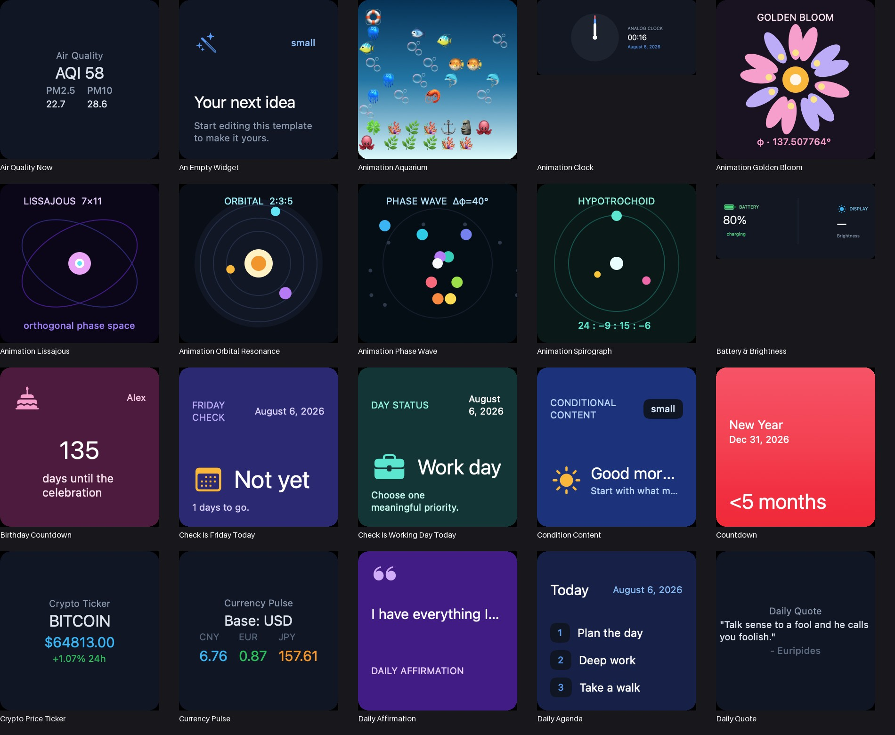
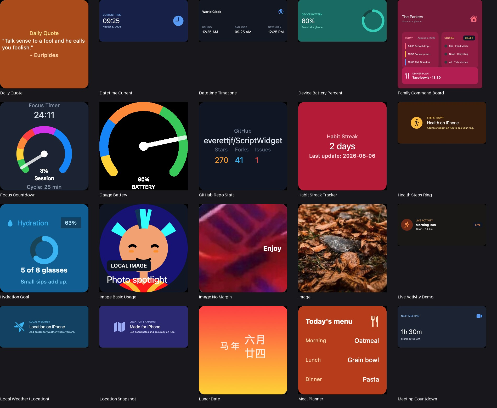

# ScriptWidget 🎨

Website: <https://xnu.app/scriptwidget/>

<div align="center">

[](https://github.com/everettjf/ScriptWidget/stargazers)
[](https://github.com/everettjf/ScriptWidget/network)
[](LICENSE)
[](https://developer.apple.com)
[](https://github.com/everettjf/ScriptWidget/releases)
[](https://github.com/everettjf/ScriptWidget/actions/workflows/release-readiness.yml)

**Create native widgets for iPhone, iPad, and Mac with JavaScript, JSX, and AI**

[English](README.md) | [简体中文](README_CN.md) | [Español](README_ES.md) | [日本語](README_JA.md) | [한국어](README_KO.md) | [Français](README_FR.md) | [Deutsch](README_DE.md) | [Português](README_PT_BR.md) | [Русский](README_RU.md) | [العربية](README_AR.md)

</div>

> ✨ *Build iPhone, iPad, and Mac widgets in ScriptWidget Studio—without writing Swift.*

---

## 🎯 What is ScriptWidget?

ScriptWidget is an open-source widget development platform for building native WidgetKit experiences with **JavaScript** and **JSX-like syntax**. Write once, preview on Mac, and run the same package on iPhone, iPad, and Mac—without requiring Swift for widget authoring.

It combines a JavaScriptCore runtime, native SwiftUI rendering, a desktop development environment, secure package sharing, AI-assisted generation, and a GitHub-backed community catalog.



---

## ✨ Features

| Feature | Description |
|---------|-------------|
| 🖥️ **Cross-Platform** | One codebase for iOS and macOS widgets |
| 🎨 **JSX Support** | Declarative UI with JavaScript XML syntax |
| ⚡ **Native Rendering** | JSX elements are rendered as native SwiftUI views |
| 🔧 **Versioned Runtime API** | Storage, files, networking, device, location, health, system, and data sources |
| 📱 **Interactive Widgets** | Links, buttons, toggles, App Intents, Live Activities, and Control Widgets |
| 🎨 **Custom Styling** | Full control over appearance |
| 📦 **Template Gallery** | Pre-built templates to get started |
| 🌐 **Community Gallery** | Verified, one-click Widget and AI Skill installs |
| 🧰 **ScriptWidget Studio** | Build on Mac with CodeMirror, diagnostics, console, and multi-size preview |
| ✨ **AI Generation** | Generate, run, diagnose, and refine widgets with an OpenAI-compatible model |
| 🧠 **Skills 1.0** | Import, author, export, and share focused AI instructions |
| 📦 **Package 2.0** | Versioned `widget.json`, permissions, host allowlists, migration, and hardened imports |
| 🔌 **Data Source Plugins** | Declarative third-party API connectors with a Mac request lab |

### ScriptWidget Studio for Mac

Studio is the primary place to build widgets:

- project file tree with multiple JavaScript/JSON files and package resources;
- CodeMirror 6 editing, schema completions, diagnostics, formatting, autosave, and crash recovery;
- live preview for one or every supported widget family, plus runtime console and timing information;
- Config panel for `widget.json`, families, permissions, network domains, plugins, and preview parameters;
- AI generation with provider profiles, iterative run/diagnose/refine, and reusable Skills;
- verified Widget & Skills Gallery and a Data Source Lab for testing plugin operations.

The first-launch guide can create a complete tutorial widget and walk a new user from editing through adding it to the desktop in about five minutes.

---

## 🚀 Quick Start

### 1. Download

```bash
# Clone the repository
git clone https://github.com/everettjf/ScriptWidget.git
cd ScriptWidget
```

### 2. Open in Xcode

```bash
# iOS app + widget + share extension
open iOS/ScriptWidget.xcodeproj

# macOS app + widget
open macOS/ScriptWidgetMac.xcodeproj
```

### 3. Run & Explore

1. Select a scheme (`ScriptWidget` / `ScriptWidgetWidget` for iOS, `ScriptWidgetMac` for macOS)
2. Enable the `iCloud.ScriptWidget` container and `group.everettjf.scriptwidget` app group so script storage works
3. Press `Cmd + R` to build and run
4. Browse the bundled example scripts under `Shared/ScriptWidgetRuntime/Resource/Script.bundle/` (`api/`, `component/`, `template/`)

---

## 📁 Project Structure

```
ScriptWidget/
├── Shared/
│   └── ScriptWidgetRuntime/   # Core runtime: JavaScriptCore host, JSX→SwiftUI
│       ├── AI/                # Provider settings, agent loop, evals, Skills
│       ├── Common/            # Script storage, Package 2.0, cache & imports
│       ├── Gallery/           # Verified GitHub catalog, cache & installer
│       ├── Plugin/            # Declarative Data Source Plugin runtime
│       ├── Widget/Runtime/    # JS engine setup, Babel transform, execution
│       ├── Widget/API/        # JS APIs ($device, $file, $storage, ...)
│       ├── Widget/Component/  # Element → SwiftUI view mapping
│       └── Resource/          # Babel bundle + bundled example scripts
├── iOS/
│   ├── ScriptWidget/          # iOS app (editor, settings)
│   ├── ScriptWidgetWidget/    # Widget, Live Activity, Control Widget
│   └── ScriptWidgetShare/     # Share extension
├── macOS/
│   ├── ScriptWidgetMac/       # macOS app
│   └── ScriptWidgetMacWidget/ # macOS widget
├── Editor/editorfe/           # Vite + CodeMirror 6 editor frontend
├── Gallery/                   # Curated Widget & Skills Gallery index
├── Tests/                     # Shared runtime, execution, cache & security tests
├── docs/                      # User, API, package, Skills & release documentation
├── Resource/                  # Marketing assets, screenshots
└── README.md
```

---

## 💻 Example Widgets

A script's entry point is the `$render(...)` call, which takes a JSX tree built from
runtime tags (`vstack`, `hstack`, `zstack`, `text`, `image`, `gauge`, `chart`, ...).

### Hello World

```jsx
$render(
  <vstack frame="max">
    <text font="title">Hello, ScriptWidget! 👋</text>
  </vstack>
);
```

### Fetch remote data

```jsx
const result = await fetch("https://jsonplaceholder.typicode.com/todos/1");
const model = JSON.parse(result);

$render(
  <vstack>
    <text font="title">{model.title}</text>
  </vstack>
);
```

Package 2.0 widgets using network access must declare the `network` permission and matching hosts in `widget.json`.

### Use a Data Source Plugin

```jsx
const weather = await $dataSource.request(
  "app.scriptwidget.datasource.open-meteo",
  "forecast",
  { latitude: "37.7749", longitude: "-122.4194" }
);

$render(
  <vstack frame="max" padding="16">
    <text font="caption">San Francisco</text>
    <text font="largeTitle">{weather.current.temperature_2m}°</text>
  </vstack>
);
```

The package must declare the plugin identifier, `network` permission, and the plugin host. Plugins are declarative HTTPS request mappings—not executable native extensions.

### Persist values with `$storage`

```jsx
$storage.setString("greeting", "Hello ScriptWidget");
const greeting = $storage.getString("greeting");

$render(
  <vstack frame="max" background="#0f172a">
    <text font="caption" color="#94a3b8">Storage</text>
    <text font="title3" color="#e2e8f0">{greeting}</text>
  </vstack>
);
```

---

## 🛠️ Development

### Prerequisites

- **Xcode** 27+ for the current development branch
- **macOS** 26+ for ScriptWidget Studio
- **iOS** 16+ (for iOS widgets)

### Build from Source

```bash
# Clone and setup
git clone https://github.com/everettjf/ScriptWidget.git
cd ScriptWidget

# Open in Xcode (pick the platform you want)
open iOS/ScriptWidget.xcodeproj      # iOS
open macOS/ScriptWidgetMac.xcodeproj # macOS

# Build and run (Cmd + R)
```

The editor frontend (React + CodeMirror) lives in `Editor/editorfe`:

```bash
cd Editor/editorfe
npm install
npm start   # dev server at http://localhost:3000
npm test
npm run build
npm run release # rebuild and copy StudioEditor.bundle into both apps
```

Run the same repository gates used by CI:

```bash
./Scripts/release-readiness.sh
./Scripts/ipad-icloud-tests.sh
```

### Create Your Own Widget

1. Open **ScriptWidget Studio** on Mac (or ScriptWidget on iPhone/iPad) and create a script from a template, AI prompt, or blank project
2. Write your widget in `main.jsx` and call `$render(...)` with a JSX tree
3. Use the live preview to iterate, then add the widget from the Home Screen

Each widget is stored under `Scripts/<PackageName>/` and synced through iCloud/app-group storage. New projects use Package 2.0:

```text
My Widget/
├── widget.json
├── main.jsx
├── lib/
│   └── format.js
└── image/
    └── background.png
```

`widget.json` is the authoritative, versioned manifest. It declares the entry point, supported families, permissions, allowed network hosts, and Data Source Plugins. Legacy `main.jsx`/`meta.json` packages remain readable and migrate during supported import/export flows.

---

## 📚 Documentation

Start with the **[documentation hub](docs/README.md)** or build **[your first widget](docs/getting-started.md)** in ScriptWidget Studio.

### Core Concepts

- **Entry point** - call `$render(<tree/>)` to draw the widget
- **Components** - `vstack`, `hstack`, `zstack`, `text`, `image`, `gauge`, `chart`, shapes, ...
- **Styling** - element attributes such as `font`, `color`, `background`, `frame`, `padding`
- **Widget sizes** - read `$getenv("widget-size")` (small / medium / large / accessory…)
- **Interactions** - buttons and links via App Intents

### APIs

| API | Description |
|-----|-------------|
| `fetch()` | HTTP requests (`fetch`/`$fetch`) |
| `$storage` | Persisted key/value store (string & JSON) |
| `$file` | Read/write files in the script package |
| `$device` | Device info (model, battery, screen, dark mode, …) |
| `$location` | Location & geocoding |
| `$health` | HealthKit data (steps, heart rate, …) |
| `$system` | System info (timezone, app version, …) |
| `$import` | Import another file from the package |
| `$dataSource` | Call a declared Data Source Plugin operation |
| `$runtime` | Runtime API version and enforced resource limits |
| `console` | Logging (`console.log` / `console.error`) |

The native JSX component switch is the runtime authority. Studio keeps static completion metadata in [`scriptWidgetAPI.js`](Editor/editorfe/src/scriptWidgetAPI.js), checks it against the native switch, and generates the [Runtime API reference](docs/scriptwidget-runtime-api.md) from it.

## 🔐 Security model

Widget packages, Gallery content, Skills, and Data Source Plugins are treated as untrusted input:

- Package 2.0 rejects unknown fields and unsupported versions.
- Archive imports reject traversal, absolute paths, symlinks, encrypted entries, case collisions, malformed ZIP metadata, and oversized payloads.
- Package file access remains package-relative; storage is package-namespaced and bounded.
- Package 2.0 networking requires explicit permission and a matching host declaration; generic fetches are limited to public HTTP(S), while Data Source Plugins require HTTPS. Private/local hosts and oversized responses are rejected.
- Gallery files are restricted to the curated GitHub trust root and verified by exact byte count and SHA-256 before installation.
- Skills are prompt-only and cannot execute code, access secrets, or grant runtime permissions.
- Data Source Plugins are declarative request mappings and cannot load arbitrary native code.

See [Package 2.0](docs/package-format.md), [modern WidgetKit features](docs/widgetkit-modern-features.md), [Skills 1.0](docs/skills.md), [Gallery](docs/gallery.md), and [Data Source Plugins](docs/data-source-plugins.md) for the complete contracts.

---

## 🎨 Gallery

<div align="center">



*Sample widgets created with ScriptWidget*

</div>

---

## 📱 Platforms

| Platform | Support | Notes |
|----------|---------|-------|
| **iOS** | ✅ Full | iOS 16+ (iPhone, iPad) |
| **macOS** | ✅ Full | macOS 26+ (Mac) |
| **watchOS** | — | Not in the current roadmap |
| **visionOS** | — | Not in the current roadmap |

---

## 🤝 Contributing

Contributions are welcome! Please read our [Contributing Guide](CONTRIBUTING.md) for details.

### Ways to Contribute

- 🐛 Report bugs
- 💡 Suggest features
- 🔧 Submit pull requests
- 📝 Write documentation
- 🎨 Share your widgets
- 🧠 Share focused AI Skills

See the [public roadmap](ROADMAP.md), [governance model](GOVERNANCE.md), and [Gallery submission guide](docs/gallery.md). Every pull request runs the same release-readiness checks used locally.

---

## 📜 License

The source code in this repository is released under the [MIT License](LICENSE).

The ScriptWidget name, logos, screenshots, and App Store marketing materials are not licensed under the MIT License. All rights to those brand and marketing assets are reserved by their respective owners.

---

## 🙏 Acknowledgements

Built with:
- [JavaScriptCore](https://developer.apple.com/documentation/javascriptcore) - Apple's JavaScript engine
- [SwiftUI](https://developer.apple.com/xcode/swiftui/) - Modern UI framework
- [Xcode Gen](https://github.com/yonaskolb/XcodeGen) - Project generation

Inspired by:
- [React](https://reactjs.org/) - Component-based UI
- [React Native](https://reactnative.dev/) - Mobile development
- [WidgetKit](https://developer.apple.com/documentation/widgetkit) - Apple's widget framework

---

## 📈 Star History

<div align="center">

[](https://star-history.com/#everettjf/ScriptWidget&Date)

</div>

---

## 📞 Support

<div align="center">

[](https://github.com/everettjf/ScriptWidget/issues)
[](https://github.com/everettjf/ScriptWidget/discussions)
[](https://discord.gg/eGzEaP6TzR)

**有问题？去 [Issues](https://github.com/everettjf/ScriptWidget/issues) 提问！**

</div>

---

<div align="center">

**Made with ❤️ by [Everett](https://github.com/everettjf)**

**Project Link:** [https://github.com/everettjf/ScriptWidget](https://github.com/everettjf/ScriptWidget)

</div>
